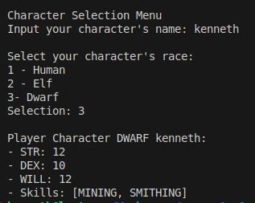

# Fantasy Character Builder

**Situation**: A game developer is making his dream fantasy RPG. The most fundamental part of an RPG is creating your own character to identified with, so the developer has been working on the character creation menu. His current plans include the player selecting a character from one of three races: Human, Elf, or Dwarf. Each of these will grant players with different boosts and skills. 

## Builder Pattern
The **Builder Design Pattern** will allow the game developer to construct their desired character creation menu. The Builder Pattern allows for a step-by-step construction of an object. In this case, it is a perfect solution for the current situation, as the Builder Pattern could give the player enough customization options.

### Product - PlayerCharacter
The `PlayerCharacter` class represents a player's own avatar. The player can decide the character's name and race, but its other attributes like strength, dexterity, willpower and skills are instead determined by the different builders.

```
public class PlayerCharacter{
    String name;
    FantasyRace race;
    int strength;
    int dexterity;
    int willpower;
    List<Skills> skills;

    public PlayerCharacter(String name){
        // Constructor
    }
}
```

### Builder - CharacterBuilder
`CharacterBuilder` is the interface that dtermines the step required for character creation. This interface provides the method definition for the concrete builders to use.
```
public interface CharacterBuilder {
    void buildRace();
    void buildAttributes();
    void buildSkills();
    PlayerCharacter getCharacter();
}
```
### ConcreteBuilders - HumanBuilder, DwarfBuilder, ElfBuilder
These 3 builders determine what the initial character will be, depending on the fantasy lineage selected. Aside from determining the character's race, each builder also provides different boosts to the player's stats, as well as different skill proficiencies. 

**Example: DwarfBuilder**
```
public class DwarfBuilder implements CharacterBuilder{
    private PlayerCharacter character;

    public DwarfBuilder(String name){
        this.character = new PlayerCharacter(name);
    }

    @Override
    public void buildRace(){
        this.character.setFantasyRace(FantasyRace.DWARF);
    }

    @Override
    public void buildAttributes(){
        this.character.strength += 2;
        this.character.willpower += 2;
    }

    @Override
    public void buildSkills(){
        List<Skills> skills = List.of(Skills.MINING, Skills.SMITHING);
        this.character.setSkills(skills);
    }

    @Override
    public PlayerCharacter getCharacter(){
        return this.character;
    }
}
```
## Execution
To begin the character creation process, the player will first be asked to provide their character's name. 
After inputting the desired name, the player will then be prompted to select a fantasy race from the available options. The program will verify that the player is selecting a valid option, or else it will keep asking until it is provided one. 
After the selection, the program will determine the appropriate builder for the desired option, and will then proceed to constructing the Player Character. Once the character is finally created, the resulting character will be displayed on the console, finishing the execution of the program.



# Conclusion
Before this project I had knowledge about some design patterns, but I didn't know about the Builder pattern. I can now say that I appreciate the benefits it provides, as it allows much flexibility in creating different variations of the same object without modifying its class.
I feel confident about applying this design pattern if the appropriate situation is ever presented in a future project, but will keep trying and testing its uses and applications. 