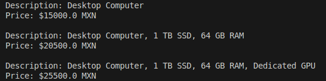

# Computer Build Decorator

[Download PDF Version](https://raw.githubusercontent.com/kennethrdzg/proyectosAcademiaJava/main/week-3/design-patterns/decorator/DecoratorDesignPattern.pdf)

**Situation**: A computer science student has decided to buy their own desktop computer, but with so many available options and upgrades they cannot decide which parts are best for their needs. Should he invest more money on a dedicated GPU, or should he instead use that money to buy more RAM sticks? Instead of agonizing over this problem, they have instead decided to write a program to compare a base computer's specs and cost against an upgraded one, and decide which has the best **Price Value**.

## Decorator Pattern
The Decorator Pattern is a great solution for this problem, as the pattern takes a base product and uses modifiers, or **decorators** to change its properties. By using this design pattern the student will be capable of observing the trade-offs between different computer builds and pick the one that betters fits their budget.

### Component - Computer

The `Computer` interface will represent the base component of a computer build. It defines two methods: `getDescription()` and `getPrice()`, which all other computers will implement.

```
public interface Computer {
    String getDescription();
    double getPrice();
}
```

### Concrete Component - BaseComputer

The `BaseComputer` class serves as the blueprint for all other computer builds. It provides the base implementations of the `getDescription()` and `getPrice()` methods.

```
public class BaseComputer implements Computer{
    @Override
    public String getDescription(){
        return "Desktop Computer";
    }

    @Override
    public double getPrice(){
        return 15000.0;
    }
}
```

### Decorator - Upgrade

The `Upgrade` class is an abstract class, as all other specific upgrades inherit from this class.

```
abstract class Upgrade implements Computer{
    protected Computer decoratedComputer;

    public Upgrade(Computer decoratedComputer){
        this.decoratedComputer = decoratedComputer;
    }

    @Override
    public String getDescription(){
        return decoratedComputer.getDescription();
    }

    @Override
    public double getPrice(){
        return decoratedComputer.getPrice();
    }
}
```

### Concrete Decorators - GraphicsUpgrade, RAMUpgrade, SSDUpgrade

These classes `GraphicsUpgrade`, `RAMUpgrade`, and `SSDUpgrade` represent upgrades to a computer's graphics card, RAM sticks, and SSD, respectively. Each of this upgrades decorates the base computer's description and price- 

**Example: GraphicsUpgrade**

```
public class GraphicsUpgrade extends Upgrade{
    public GraphicsUpgrade(Computer decoratgedComputer){
        super(decoratgedComputer);
    }

    @Override
    public String getDescription(){
        return decoratedComputer.getDescription() + ", Dedicated GPU";
    }

    @Override
    public double getPrice(){
        return decoratedComputer.getPrice() + 5000.0;
    }
}
```

## Execution
The program will prepare three different tiers of potential computer builds, which will allow for a simple comparison between them. The output will consist of each computer's description, as well as their price in Mexican pesos. By observing these results, we can now compare the price value of each, as well as our budget, to make the decision that best suits us.



## Conclusion
I can appreciate how this design pattern is effective, specially by preventing an object's modification and instead extending its behavior. It also prevents other design problems, like multiple levels of inheritance. However, I am also now aware of how the complexity of this pattern can escalate quickly.  

For example, in the following line of code, 
`Computer gamingPC = new GraphicsUpgrade(new RAMUpgrade(new SSDUpgrade(new BaseComputer())));`, 
just by using three decorators the line is already becoming hard to long, leading to potential code readability problems. 

This problem doesn't disincentivize me to use the design pattern. Instead, I am now motivated to properly and thoroughly understand it to best apply it in the correct scenario.
