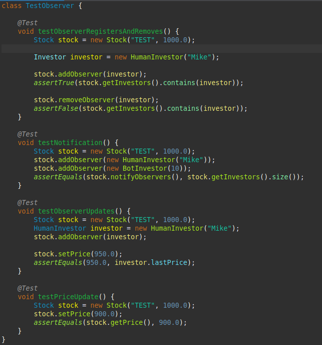
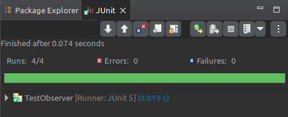

# Stock Market Observer Simulation

[Download PDF Version](https://raw.githubusercontent.com/kennethrdzg/proyectosAcademiaJava/week-3/design-patterns/observer/ObserverDesignPattern.pdf)

**Situation**: A group of computer science students wants to determine if they can make a stock trading bot that is better than themselves at making profit. For this purpose they have decided to code a bot with Java that observes the price changes in the **Mapple** stock. 
After creating their algorithm, they assign the bot an initial budget of $10,000.0 to buy stock. When the bot decides to either sell or buy stock, one member of the group will perform the corresponding action. Another member of the group is also given $10,000.0 to trade, but he will only rely on his intuition to make business decisions. 
The experiment will last a year, and at the end they will compare which team has made the most profit.

## Observer Pattern
The situation can be represented using the **Observer Pattern**, in which a subject (in this case, the **Mapple Stock**) has a list of observers who need to be updated when signaled. The observers (A.K.A. the Investors) will be watching for changes in the Mapple stock price, and act acordingly.

### Subject - Stock
The `Stock` class represents the stock of a company. As the Subject of our Observable pattern, the class has a list of the observers (Investors) currently interested in the stock. 
After each day, the price of the stock will be updated according to the market and each of the current observers will be notified with the method `notifyObservers`.

```
public class Stock {
    String name;
    private List<Investor> observers = new ArrayList<>();
    private double price;

    // Constructors

    public void addObserver(Investor investor){
        observers.add(investor);
    }

    public void removeObserver(Investor investor){
        observers.remove(investor);
    }

    public void notifyObservers(){
        for(Investor investor: observers){
            investor.update(this);
        }
    }

    // Getters and Setters
}
```

### Observer - Investor
Our Observer `Investor` is an interface that allows classes to implement observing features. 
The interface consists of two methods: **update()** and **sellAll()**. 
- update(): the implementations will execute the trading algorithm each observer has decided. 
- sellAll(): this method will sell all the current shares any Investor owns, using the last known price of the observed `Stock`.

```
public interface Investor {
    void update(Stock stock);

    void sellAll();
}
```
### Concrete Observer - HumanInvestor
The `HumanInvestor` class implements the `Investor` interface, allowing it to observe a desired `Stock`. The class has other attributes like `budget`, which represents the current available money, `shares`, which represents the number of shares currently owned by the Investor, and `lastPrice`, which keeps track of the last known value of the observed stock price. 

The "trading" algorithm is a very simple implementation: if the current price is lower than the last known price, buy stock; if the current price is higher than the last known price, sell stock.
```
public class HumanInvestor implements Investor{
    String name;
    double initialBudget;
    double budget;
    int shares;
    double lastPrice;

    public HumanInvestor(String name){
        this.name = name;
        this.initialBudget = 10000.0;
        this.budget = this.initialBudget;
        this.shares = 0;
    }
    
    @Override
    public void update(Stock stock){
        // Method implementation
    }
}
```

### Concrete Observer - BotInvestor
The `BotInvestor` class is similar to the `HumanInvestor`, except it contains two more attributes, `historySize` and `priceHistory`, and the trading algorithm is more complex. An instance of this class keeps track of some of the last values of the observed price, allowing instances to determine a trend in the last known prices. The List `priceHistory` keeps track of a list of price values, while the Integer `historySize` determines the maximum size of the `priceHistory` list. 

The trading algorithm uses `priceHistory` to determine a positive, negative, or neutral trend on the stock price. When the class receives an update from the `Stock` subject, it will update the price history with the latest stock price, and will then determine the current trend of the stock price. If the trend is negative (stock price is decreasing), it will buy shares; if the trend is positive (stock price is increasing) it will sell its shares. 
```
public class BotInvestor implements Investor {
    double initialBudget;
    double budget;
    int shares;
    double lastPrice;
    int historySize;
    List<Double> priceHistory;

    public BotInvestor(int historySize){
        this.initialBudget = 10000.0;
        this.budget = this.initialBudget;
        this.historySize = historySize;
        this.priceHistory = new ArrayList<>();
        shares = 0;
    }

    @Override
    public void update(Stock stock){
        // Method implementation
    }
}
```

## Execution
Running the program will represent the experiment taking place. The `Stock`, `HumanInvestor` and `BotInvestor` classes will be instantiated, but we must also create a `Random` object, which will represent the "randomness" of the stock market, allowing the stock price to vary.

After all objects are set up, a `for` loop will represent the passage of time, where each loop is a day of the experiment. Each day the stock price is updated, and the observers are all notified and act according to their own algorithm. 

After the loop is over (representing the end of the year-long experiment), all observers will sell any remaining stock regardless of the current price of the stock. By tallying the final available money and comparing it to the initial budget, we can determine how much profit was made (or how much money was lost). 

```
public class Main {
    public static void main(String[] args) throws Exception {
        Random market = new Random();
        Stock mappleStock = new Stock("MAPPLE", 1000.0);
        HumanInvestor humanInvestor = new HumanInvestor("John");
        BotInvestor botInvestor = new BotInvestor(20);

        mappleStock.addObserver(humanInvestor);
        humanInvestor.lastPrice = mappleStock.getPrice();

        mappleStock.addObserver(botInvestor);
        botInvestor.lastPrice = mappleStock.getPrice();

        System.out.println("Initial Price: " + mappleStock);

        // Each loop represents a day of stock market exchange
        for(int i = 0; i < 365; i++){
            mappleStock.setPrice(mappleStock.getPrice() * (1 + market.nextDouble(-0.1, 0.1)));
        }

        System.out.println("Final Price: " + mappleStock);
        
        botInvestor.sellAll();
        humanInvestor.sellAll();

        mappleStock.removeObserver(humanInvestor);
        mappleStock.removeObserver(botInvestor);
    }
}
```

## Unit Testing
By Unit testing, we can check and validate methods or sections of code to guarantee their behavior is accurate to our expectations. For this project, it is very much important that stock prices are properly updated, that all observers are notified of change, and that they act accordingly. For this reason, the class `TestObserver` will provide some tests to perform and validate the project's behavior. 



After running our tests, we can observe that they have been executed without failures. 



## Conclusion
The Observer pattern is one that is ever present in our daily lives. From news outlets, to phone messages, to social media notifications, this pattern can be simple to understand, but interesting to implement nonetheless. I've worked with similar styles, but finally understanding the design pattern properly is very refreshing.

Introducing unit testing to the project was very exciting. As someone who has only ever used print statements to debug errors, learning a new tool for finding bugs and errors was a learning experience, but one I appreciated a lot. 
