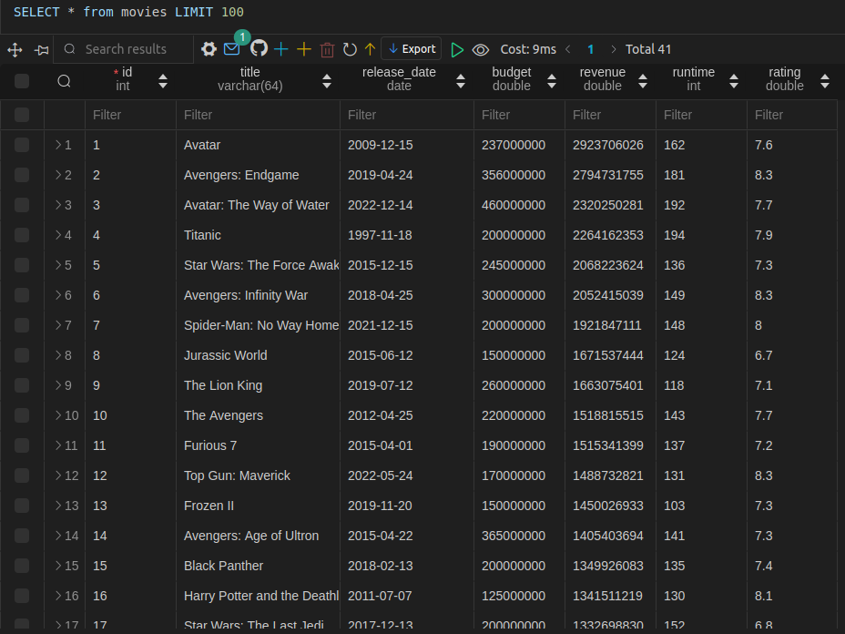

# Java Persistence API

[Download PDF Version](raw.githubusercontent.com/kennethrdzg/proyectosAcademiaJava/main/week-3/jpa/JPA.pdf)

This project is a demonstration of the Java Persistence API using Spring Boot. Using the JPA and MySQL, we will create a movie database with information about movies' titles, release date, budget, revenue, runtime and public rating, as well as a Java application that will interact with the database. 
Using the JPA will allow us to simplify the process of managing a database with Java, removing the need to write manual SQL queries and preventing potential SQL Injection attacks.

## Database
For this project, we will create a database with some of the most popular movies in TMDB. We can use this publicly available [dataset](https://www.kaggle.com/datasets/ursmaheshj/top-10000-popular-movies-tmdb-05-2023) to get the data we need to construct our database. 

### Creating the database
With the following SQL script, we can create a MySQL Database and Table to store our data.
```
CREATE DATABASE IF NOT EXISTS MovieDB;

USE MovieDB;

DROP TABLE IF EXISTS movies;

CREATE TABLE movies (
    id INT NOT NULL AUTO_INCREMENT PRIMARY KEY, 
    title VARCHAR(64) DEFAULT NULL, 
    releaseDate DATE DEFAULT NULL,
    originalLanguage VARCHAR(64) DEFAULT NULL,
    budget DOUBLE DEFAULT 0,
    revenue DOUBLE DEFAULT 0,
    runtime INT DEFAULT 0,
    rating DOUBLE
) AUTO_INCREMENT=1;
```
Now we can insert values into the table and populate the database. 

Finally, we can perform a simple query to see that our database has been set up correctly. 

`SELECT * FROM movies;`

If everything is fine, we should get a result like this:



The database set up process can be done by executing [this SQL script](./database/create_db.sql). 

## Maven Dependencies
This project requires 2 dependencies to work properly: **Spring Data JPA** and **MySQL Connector/J**.

### Spring Data JPA
This dependency helps implement a JPA application. It will essentially be the backbone of the project, as it will allow integration with our database.

```
<dependency>
    <groupId>org.springframework.boot</groupId>
    <artifactId>spring-boot-starter-data-jpa</artifactId>
    <version>3.2.9</version>
</dependency>
```

### MySQL Connector/J
This dependency provides the driver necessary for connecting our application with a MySQL database. This driver may be exchanged for another to allow connections with other databases. 

```
<dependency>
    <groupId>com.mysql</groupId>
    <artifactId>mysql-connector-j</artifactId>
    <version>8.4.0</version>
</dependency>
```

## Project Resources
For the Spring application to work correctly, we must provide it with login access to the database. Within the `resources` directory in the project source files, we must include a file named `application.properties`, which should contain the necessary credentials, such as the database URL, username, and password.

The properties file should resemble something like this:
```
spring.datasource.url=jdbc:mysql://localhost:3306/MovieDB
# spring.datasource.username=USERNAME
# spring.datasource.password=PASSWORD
```

**Note**: For the security reasons I have not included my database login information, and an example file has been added instead.

## Classes
The application consists of 4 classes and interfaces: `MovieApp`, `Movie`, `MovieDAO`, and `MovieDAOImpl`.

### MovieApp
`MovieApp` is our Spring application, as it will execute the desired queries. 
In particular, the `commandLineRunner` method with the `@Bean` annotation is what will determine what method will be executed when Spring Boot is initialized. 

```
package com.kennethrdzg.jpa;

// Imports ...

@SpringBootApplication
public class MovieApp {
    public static void main(String[] args) {
        SpringApplication.run(MovieApp.class, args);
    }

    @Bean
    public CommandLineRunner commandLineRunner(MovieDAO movieDAO){
        return runner -> {
            createMovie(movieDAO);
            readMovie(movieDAO);
            queryAllMovies(movieDAO);
            queryMoviesByTitle(movieDAO);
            updateMovie(movieDAO);
            deleteMovie(movieDAO);
            deleteAllMovies(movieDAO);
        };
    }
    // Methods...
}
```

### Movie
This class represents an entity of Movie, and is associated with the database table `"movie"`. Each of this class's attributes, like `id` or `title` is associated with one of the tables columns, which will help map each value in the table to an instance of this class. 

The parameters of this class are: 
- **id**: An `Integer`, and the primary key of the table.
- **title**: a `String`
- **releaseDate**: a `LocalDate` object.
- **budget**: a `Double`
- **revenue**: a `Double`
- **runtime**: an `Integer` representing the movie's duration.
- **rating**: a `Double`, the average rating of the film by audiences.

```
@Entity
@Table(name = "movies")
public class Movie {
    @Id
    @GeneratedValue(strategy = GenerationType.IDENTITY)
    @Column(name = "id")
    private int id;

    // Other Attributes

    // Constructors
    public Movie(){
    }

    public Movie(String title, LocalDate releaseDate, double budget, double revenue, int runtime, double rating){
        this.title = title;
        this.releaseDate = releaseDate;
        this.budget = budget;
        this.revenue = revenue;
        this.runtime = runtime;
        this.rating = rating;
    }

    // Getters and Setters...
}
```
### MovieDAO
This interface represents a `Data Access Object`, which allows it to interact with the database to execute queries. 
The interface does not contain method implementations, only definitions. Instead, the class `MovieDAOImpl` will contain the implementations and define the behavior of each method.

```
public interface MovieDAO {
    void save(Movie movie);
    Movie findById(Integer id);
    List<Movie> findAll();
    List<Movie> findByTitle(String title);
    void update(Movie movie);
    void delete(Integer id);
    int deleteAll(); 
}
```

### MovieDAOImpl
This class implements the `MovieDAO` interface, and defines the behavior for each of its methods.

Some of this class's methods are transactional, which means that changes to the database are executed and saved only if everything was executed correctly. This prevents the unwanted loss of data (like updating an entry incorrectly).

The only attribute of this class is `entityManager`, which is used to provide persistence to entity instances in the program.

```
@Repository
public class MovieDAOImpl implements MovieDAO {
    private EntityManager entityManager;

    @Autowired
    public MovieDAOImpl(EntityManager entityManager){
        this.entityManager = entityManager;
    }

    // Other method implementations
}
```

## Result
Once we execute the application, we can observe how Spring Boot is initialized. 


After initialization is finished, all methods called by the `commandLineRunner` method in `MovieApp` will be executed, resulting in an output similar to this:


Finally, when all methods have been executed, the Spring application will shutdown. 
